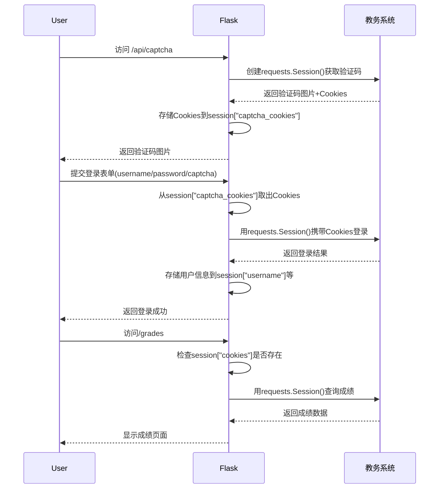

### **1. Flask Session（服务器端会话）**

Flask Session 用于在服务端存储用户状态（默认使用客户端 Cookie 存储加密数据）。

#### **关键流程**

1. **获取验证码时**  
   - 生成验证码图片，并存储 `requests.Session()` 的 Cookies 到 **Flask Session**  

   ```python
   @main.route("/api/captcha")
   def captcha():
       img_base64, cookies = get_captcha_base64()
       session["captcha_cookies"] = cookies  # 存储验证码对应的cookies
       return jsonify({"captcha": img_base64})
   ```

2. **用户登录时**  
   - 从 Flask Session 取出验证码 Cookies  
   - 登录成功后，存储用户信息和教务系统 Cookies  

   ```python
   def api_login():
       captcha_cookies = session.get("captcha_cookies", {})  # 取出验证码cookies
       user_session = login_and_get_session(username, password, captcha_code, captcha_cookies)
       
       # 登录成功后存储用户状态
       session["username"] = username
       session["student_name"] = student_name
       session["cookies"] = user_session.cookies.get_dict()  # 存储教务系统cookies
   ```

3. **访问受保护路由时**  
   - 检查 Flask Session 中是否存在登录凭证  

   ```python
   @main.route("/grades")
   def grades():
       if "cookies" not in session:  # 检查是否登录
           return redirect(url_for("main.login"))
   ```

4. **会话失效**  
   - 关闭浏览器或超过默认有效期（默认 31 天）后，Flask Session 自动失效。

---

### **2. requests.Session（HTTP 客户端会话）**

用于维持与教务系统的持久连接（模拟浏览器行为）。

#### **关键流程**

1. **获取验证码**  
   - 新建 `requests.Session()` 对象，保持与教务系统的会话  

   ```python
   def get_captcha_base64():
       session = requests.Session()  # 新建临时会话
       response = session.get(captcha_url)
       return img_base64, session.cookies.get_dict()  # 返回验证码和cookies
   ```

2. **登录教务系统**  
   - 复用验证码请求的 Cookies，保持同一会话  

   ```python
   def login_and_get_session(..., cookies_dict):
       session = requests.Session()
       session.cookies.update(cookies_dict)  # 复用验证码cookies
       session.post(login_url, data=payload)  # 发送登录请求
       return session  # 返回已登录的session
   ```

3. **查询成绩/公告**  
   - 使用登录后的 `requests.Session` 访问受保护接口  

   ```python
   def api_grades():
       user_session = requests.Session()
       user_session.cookies.update(session["cookies"])  # 复用登录cookies
       grades_data = get_grades(user_session)  # 查询成绩
   ```

---

### **3. 双 Session 协作流程图**



---

### **4. 安全注意事项**

1. **Flask Session**  
   - 默认使用客户端 Cookie 存储（需设置 `SECRET_KEY` 加密）  
   - 敏感数据（如密码）不应直接存储  
   - 可通过 `flask-session` 扩展改用服务端存储（Redis 等）

2. **requests.Session**  
   - 教务系统 Cookies 存储在 Flask Session 中，需防止泄露  
   - 短期有效，建议设置会话超时  

3. **验证码会话**  
   - 验证码 Cookies 需与登录请求保持一致，否则会被教务系统拒绝  

